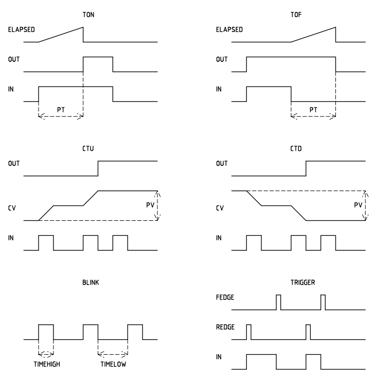

# Control #
This is a simple library reproducing IEC-61131 standard function blocks to use with arduino micro-processor or any compatible processor (Atmel AVR, Espressif, STM32, etc.).

## Revision History ##

|Version  |Comment  |Release Date |
|:-------:|:------------------|:-----------:|
|0.1      |Initial commit     |Jan 2017     |
|0.2      |blink class added  |May 2017     |

## Features ##
The library is in an early stage of development and contains the following classes:

 1. trigger: trigger objects can be used for edge detection (rising and/or falling edges)
 2. ton: allows to instantiate objects similar to IEC-61131 TON function block
 3. tof: allows to instantiate objects similar to IEC-61131 TOF function block
 4. ctu: counter up objects can be created using this class
 5. ctd: counter down objects can be created using this class
 6. blink: blink objects are used to create square signals with configurable time high and time low options (this is a non standard IEC function)



## Example ##
Check the attached ***examples*** folder for more details
``` C++
//declaring a timer off object
tof timer(sensor, 1200000);

//assign timer off output to digital out
digitalWrite(relay, (uint8_t)timer.out());
```

## Links ##
[Author's Website][1]


  [1]: http://www.akconcept.epizy.com
